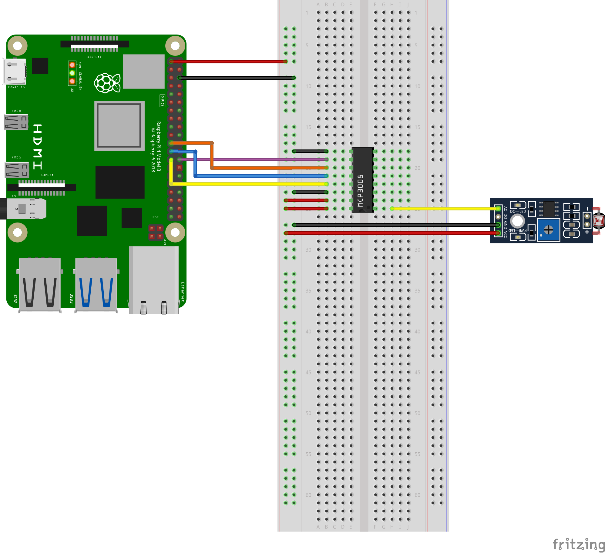

<a name="readme-top"></a>

<!--[![Contributors][contributors-shield]][contributors-url]
[![Forks][forks-shield]][forks-url]
[![Stargazers][stars-shield]][stars-url] 
[![Issues][issues-shield]][issues-url] -->
[![License][license-shield]][license-url]
[![LinkedIn][linkedin-shield]][linkedin-url]

# Automated Night Light
This project turns the user's phone into an automatic night-light. The board uses a sensor, which detects the light levels in the room. When the sensor will detect that the room is too dark, the phone’s flashlight will turn on automatically, and vice-versa: when the room is light up again, the phone’s flashlight will turn off.

<!-- TABLE OF CONTENTS -->
<details>
  <summary>Table of Contents</summary>
  <ol>
    <li><a href="#built-with">Built With</a></li>
    <li><a href="#schematics">Schematics</a></li>
    <li><a href="#prerequisites">Prerequisites</a></li>
    <li><a href="#setup-and-build">Setup and Build</a></li>
    <li><a href="#running">Running</a></li>
    <!--
    <li><a href="#usage">Usage</a></li>
    <li><a href="#roadmap">Roadmap</a></li>
    <li><a href="#contributing">Contributing</a></li>
    -->
    <li><a href="#license">License</a></li>
    <li><a href="#contact">Contact</a></li>
    <!--<li><a href="#acknowledgments">Acknowledgments</a></li>-->
  </ol>
</details>

## Built with

### Companion App
* [![Android][Android.com]][Android-url]
* [![Android Studio][AndroidStudio.com]][AndroidStudio-url]
* [![Kotlin][Kotlin.org]][Kotlin-url]

### Server
* [![Raspberry Pi][RaspberryPi]][RaspberryPi-url]
* [![Mosquitto][Mosquitto.org]][Mosquitto-url]
* [![Python][Python.org]][Python-url]

<p align="right">(<a href="#readme-top">back to top</a>)</p>

## Schematics



<p align="right">(<a href="#readme-top">back to top</a>)</p>

## Prerequisites
- [Raspberry Pi 4B board](https://www.raspberrypi.com/products/raspberry-pi-4-model-b/)
- [Eclipse Moquitto MQTT Broker](https://mosquitto.org/download/)
- [Android Studio](https://developer.android.com/studio) (I'm using Android Studio Artic Fox)
- An Android phone with a minimum API level of 27 (Android 8)
- The following individual components:
    - LDR module
    - jumper wires
    - 1 breadboard

<p align="right">(<a href="#readme-top">back to top</a>)</p>

## Setup and Build

To setup, follow these steps below.

1. Install Mosquitto MQTT Server on the Raspberry Pi
    ```
    sudo apt install mosquitto mosquitto-clients
    ```
2. Configure Mosquitto username and password
  - create the password file, which will contain the username and encrypted password
    ```
    sudo mosquitto_passwd -c /etc/mosquitto/passwd.txt <user_name>
    ```
  - add the following entries in the mosquitto.conf file, inside /etc/mosquitto folder
    ```
    allow_anonymous false
    password_file /etc/mosquitto/passwd.txt
    ```
  - restart the mosquitto server to make sure the changes are saved
    ```
    sudo systemctl restart mosquitto
    ```
3. Copy the LightSensorApp folder to Raspberry Pi
4. Modify the username and password in app.config file, inside the LightSensorApp folder
  - the username and password must be on the same line, separated by a semicolon: ';'
5. In the CompanionApp project, inside the build.gradle file from the app folder, modify the mosquitto username and password, and the Raspberry Pi server's IP address. The port must remain 1883

The `CompanionApp` project will run on the companion device e.g. Android phone.

<p align="right">(<a href="#readme-top">back to top</a>)</p>

## Running

To run the `ConsoleApp` project on your Android phone:
1. Deploy and run the `ConsoleApp` project
2. Verify that input is received from the broker
3. Verify that the flashlight is enabled when it's dark and disabled when there's light

To run the `LightSensorApp` module on a Raspberry Pi 4B board:

1. Run the following command from the terminal:
  ```
  python3 main.py
  ```
2. Verify that the sensor works and the program is printing the analog values

<p align="right">(<a href="#readme-top">back to top</a>)</p>

<!-- LICENSE -->
## License

Distributed under the MIT License. See `LICENSE.txt` for more information.

<p align="right">(<a href="#readme-top">back to top</a>)</p>


<!-- CONTACT -->
## Contact

Munteanu Claudia-Maria - Linkedin: [claudiamunteanu][linkedin-url]

Project Link: [https://github.com/claudiamunteanu/automated-night-light](https://github.com/claudiamunteanu/automated-night-light)

<p align="right">(<a href="#readme-top">back to top</a>)</p>

<!-- MARKDOWN LINKS & IMAGES -->
<!-- https://www.markdownguide.org/basic-syntax/#reference-style-links -->
[license-shield]: https://img.shields.io/github/license/claudiamunteanu/automated-night-light.svg?style=for-the-badge
[license-url]: https://github.com/claudiamunteanu/automated-night-light/blob/master/LICENCE.txt
[linkedin-shield]: https://img.shields.io/badge/-LinkedIn-black.svg?style=for-the-badge&logo=linkedin&colorB=555
[linkedin-url]: https://linkedin.com/in/claudiamunteanu
[Android.com]: https://img.shields.io/badge/Android-3DDC84?style=for-the-badge&logo=android&logoColor=white
[Android-url]: https://www.android.com/
[AndroidStudio.com]: https://img.shields.io/badge/Android%20Studio-3DDC84.svg?style=for-the-badge&logo=android-studio&logoColor=white
[AndroidStudio-url]: https://developer.android.com/studio
[Kotlin.org]: https://img.shields.io/badge/kotlin-%237F52FF.svg?style=for-the-badge&logo=kotlin&logoColor=white
[Kotlin-url]: https://kotlinlang.org/
[Python.org]: https://img.shields.io/badge/python-3670A0?style=for-the-badge&logo=python&logoColor=ffdd54
[Python-url]: https://www.python.org/
[Mosquitto.org]: https://img.shields.io/badge/mosquitto-%233C5280.svg?style=for-the-badge&logo=eclipsemosquitto&logoColor=white
[Mosquitto-url]: https://mosquitto.org/
[RaspberryPi]: https://img.shields.io/badge/-RaspberryPi-C51A4A?style=for-the-badge&logo=Raspberry-Pi
[RaspberryPi-url]: https://www.raspberrypi.com/
